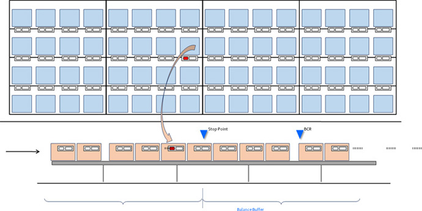

## 시스템
- [ONS(Order Navi System)](http://www.hokusho.co.kr/page/sub2_4_2.php) 사용
- **Concept**  

    
- **Process**
    1. 준비: 뒷편에는 렉(물품을 담아둔 선반)이 존재하며 각 작업자는 담당하는 구역의 렉이 정해져있음
    2. 처음에는 빈 박스가 레일에 도착
    3. 빈박스에 저장되어 있는 데이터를 기반으로 뒷편의 렉과 신호를 주고 받으며, 넣을 물품이 있는 렉에서 불이 깜빡거린다. 
    4. 꺼낸 물품을 빛이 나고 있는 박스에 넣어주고, 모든 항목에 대해서 다 넣어주게 되면 라인 스위치를 눌러준다.
    5. 이후, 옆으로 이동한다. 
- 렉의 종류: 출하량에 따라 A, B, C 등급을 매겨 전달
    - 플로렉: A등급
    - 경량렉: B,C 등급

## 목적
- 품목을 어떤 작업자에게 배치할 것인지에 대한 균등한 렉의 구성을 구하는 것

## Data 정리 
- raw data는 data folder에 저장되어 있음
    - `LA_Sample_Taiwan_Pantos_Atomy_Performance_0307.xlsx` 사용 예정
- 주요 컬럼
    - 오더 번호: 주문자
    - SKU 코드: 품목코드
    - 수량
    - Rank

## Output: 피킹리스트
- 정리 기준: 오더번호
- 어떤 품목(SKU)이 몇개(피킹수량) 들어가며, 렉을 분배받은 담당자 중 어떤 위치(location)에서 빼야 하는지를 정리

## 조건
- 렉의 크기는 중요하지 않음
- 플로렉과 경량랙의 작업량이 균등할 필요는 없음
- 수량의 데이터는 매우 중요
    - 10개에 대해서 립스틱을 줍는 것은 문제가 없지만, 휴지 10개는 이슈가 존재
    - 이에 따라 플로렉으로 처리하는 것이 타당할 경우도 존재

## 기존 작업 방식
- 총 존의 개수를 생각: 10개
- 존의 개수에 맞게 개속해서 주문수 기준으로(row base) 엑셀의 RANDWITH를 돌려 10%가 배정되면 넘어가는 식으로 프로세스 정리
    - 단, 품목 수 및 피킹 사이즈가 큰 부분에 대한 2번의 필터링 과정이 존재
        1. B2B(: 55.80L 기준, *), B2C(: 53.41L 기준, **) 구분하여 초과오더 필터링 및 최대용적을 넘지 안도록 레코드별 박스 번호 설정하고 나머지는 1로 표시
        2. SKU 코드 기준 오더의 개수가 너무나 많은 항목은 플로렉 기준으로 필터링
- location의 경우 존, x, y, 렉의 종류를 기준으로 정리 이후, 배치(입력값이 될 예정)

## TO-DO
- [ ] 요청자료 기준(`LA_Sample_Taiwan_Pantos_Atomy_Performance_0307.xlsx`) 모든 수식 파악 후 정리
- [ ] 박스 수 filtering까지 처리
- [ ] SKU code, 수량 기반 입력값(=존 수) 대비 과도한 양 FLT(플로렉 기준 필터링)
- [ ] SKU code, 수량 기반 입력값(=존 수)에 대한 배분 알고리즘 작성
--------------
- [ ] 로케이션 배분 function
- [ ] 주문번호기반 피킹리스트 배분 설정
- [ ] 박스수 기반으로 세팅하기 위한 추가 알고리즘 또는 최적화 알고리즘 모색
- [ ] 존 개수 기반으로 location 제안 로직 설계
- [ ] GUI 기반 library dependency 무관하게 처리할 수 있도록 처리
